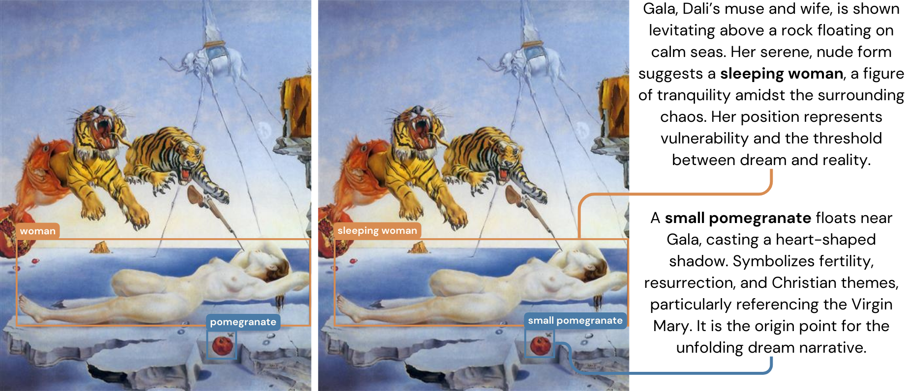
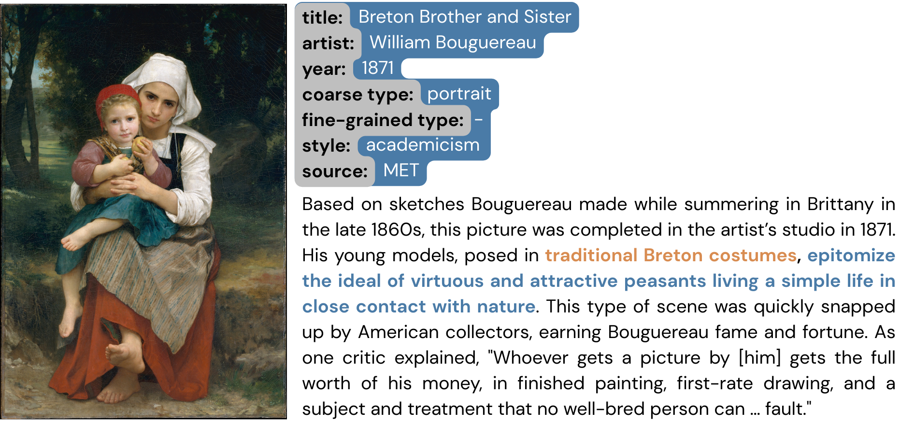
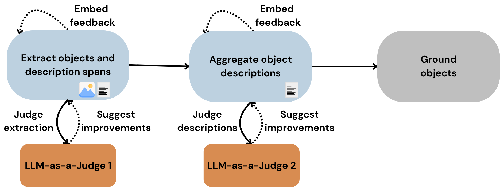
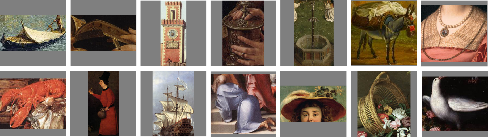
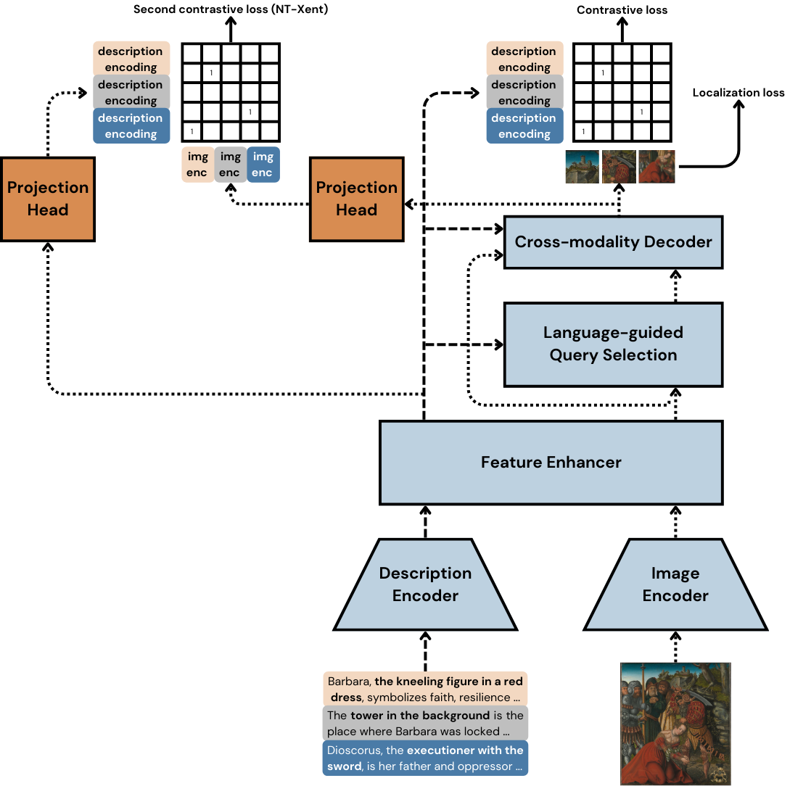
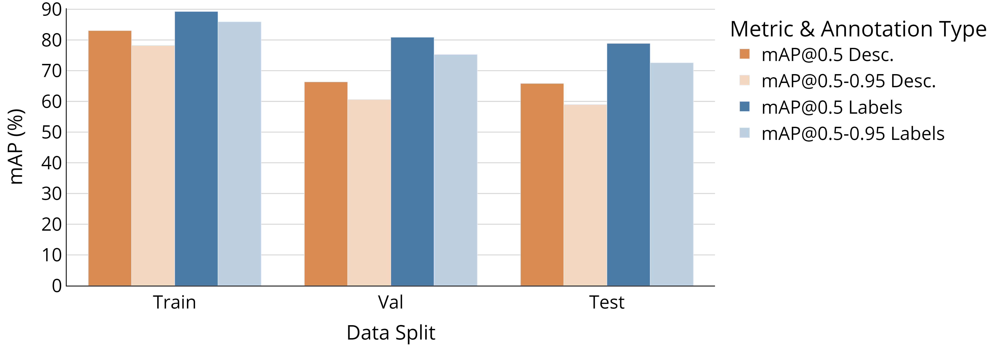
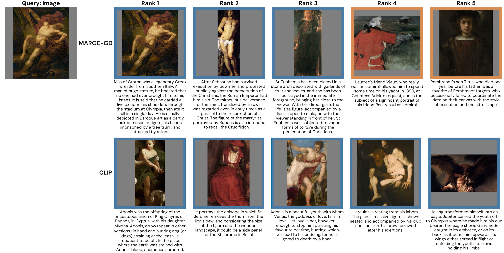

# Fine-Grained Cross-Modal Retrieval in Art via Region-Level Grounding of Symbolic Narratives

Official code for the ICMR 2026 paper. 

We introduce **RichArt**, a benchmark dataset of 7,087 paintings with 20,882 region-level annotations linking localized objects to their symbolic narratives, and **MARGE-GD**, a bimodal retrieval encoder built on Grounding DINO that achieves an MRR of 0.75 (text → region) and 0.61 (region → text), outperforming CLIP by up to 2.77×.

## Overview

Retrieving symbolic elements within paintings (e.g., *a pomegranate representing fertility*) requires fine-grained cross-modal understanding that goes beyond whole-image matching. Existing datasets only link visual regions to surface-level labels, not to expert-derived symbolic narratives.

This work addresses the gap with two contributions:

- **RichArt** — a dataset constructed via a scalable semi-automated LLM-based annotation pipeline with human validation, pairing bounding-box regions with long-form symbolic descriptions extracted from museum catalogs.
- **MARGE-GD** (Multi-modal Alignment of RichArt Grounding Embeddings via Grounding DINO) — a two-stage framework that (1) fine-tunes Grounding DINO on symbolic descriptions and (2) projects the resulting region and text representations into a shared embedding space using contrastive MLP heads.

<p align="center">
  
  <br/>
  <em>Generic labels compared to rich symbolic descriptions grounded in a painting.</em>
</p>


## Repository Structure

```
.
├── create_dataset/               # Data collection from MET, WGA, and WikiArt
├── annotate_dataset/             # LLM-based annotation pipeline (Gemini 2.0 Flash + GPT-4.1)
├── post_process_dataset/         # Filtering, merging annotations, bounding box refinement
├── analyze_data/                 # Dataset statistics and annotation analysis
├── finetune_grounding_dino/      # Data preparation and fine-tuning analysis for Grounding DINO
├── fine_tune_clip/               # CLIP fine-tuning on RichArt object crops
├── extend_grounding_dino/        # Embedding extraction and contrastive projection head training
├── evaluate_embedding_space/     # Cross-modal retrieval evaluation and embedding visualization
├── images/                       # Figures used in the paper
└── requirements.txt              # Conda environment specification
```

The Grounding DINO fine-tuning code lives in a separate repository: [Open-GroundingDINO-RichArt-Fine-Tuning](https://github.com/Bindila-Bogdan/Open-GroundingDINO-RichArt-Fine-Tuning).

## Dataset: RichArt

[](https://huggingface.co/datasets/MihaiBogdanBindila/RichArt)

RichArt is available on HuggingFace: [MihaiBogdanBindila/RichArt](https://huggingface.co/datasets/MihaiBogdanBindila/RichArt).

**Key properties:**
- 7,087 paintings by 2,288 artists spanning the 14th–21st centuries
- Sources: WGA (76.5%), MET (12.9%), WikiArt (10.6%)
- Descriptions average 35 words — significantly longer than standard captioning datasets
- 20,882 annotated objects
- 6,233 unique object labels; vocabulary covers people, architecture, animals, flora, named entitie, etc.
- Dataset split: train 80% | val 10% | test 10%

<p align="center">
  
  <br/>
  <em>Example of a collected painting and its metadata.</em>
</p>

### Annotation Pipeline

Annotations are generated in three stages using a dual-model strategy (Gemini 2.0 Flash as annotator, GPT-4.1 as judge) to mitigate self-referential bias:

1. **Object and span extraction** — Multimodal Named Entity Recognition to identify depicted and described noun phrases, verified by the judge for false positives and negatives.
2. **Description aggregation** — Extracted spans are synthesized into coherent symbolic narratives and scored on coherence, completeness, and factual accuracy.
3. **Visual grounding** — Grounding DINO (Swin-B) localizes each object sequentially to resolve ambiguity in complex scenes.

<p align="center">
  
  <br/>
  <em>The proposed LLM-based annotation pipeline.</em>
</p>

Post-annotation filtering removes low-quality outputs in two passes: 

1. **Judge-based filtering** — low-quality paintings (18.2%) and descriptions scoring below 3/5 on accuracy, coherence, or completeness (16%) are removed.
2. **Bounding box refinement** — custom NMS eliminates ~25% of over-generated boxes.

<p align="center">
  
  <br/>
  <em>Sample object images cropped from RichArt annotations.</em>
</p>


## Method: MARGE-GD

MARGE-GD extends Grounding DINO with lightweight MLP projection heads (≈527K parameters) trained with the NT-Xent contrastive loss. The GD backbone is frozen during projection head training to preserve localization capability.

- **Visual embeddings** — extracted from the final Cross-modality Decoder layer (256-d), conditioned on the textual prompt.
- **Textual embeddings** — extracted from the Feature Enhancer module (bidirectional cross-attention), average-pooled across tokens and L2-normalized.
- **Hard negative mining** — batches are constructed from objects within the same painting to force within-scene discrimination.

<p align="center">
  
  <br/>
  <em>MARGE extension (dark orange projection heads) on top of Grounding DINO (light blue blocks).</em>
</p>


## Results

### Visual Grounding on RichArt

<p align="center">
  
  <br/>
  <em>Grounding DINO fine-tuning performance across data splits and annotation types.</em>
</p>

Fine-tuned on long-form symbolic descriptions, Grounding DINO achieves mAP@0.5 = **65.84%** (vs. 78.87% on short labels), validating that modern VG architectures can generalize to abstract, long-form narratives.

### Cross-Modal Retrieval

| Query | Method | H@1 | H@5 | H@10 | MR | MRR |
|-------|--------|-----|-----|------|----|-----|
| Image | CLIP | 0.15 | 0.27 | 0.36 | 26 | 0.22 |
| Image | **MARGE-GD** | **0.55** | **0.66** | **0.72** | **1** | **0.61** |
| Image | GD (baseline) | 0.35 | 0.47 | 0.54 | 7 | 0.41 |
| Description | CLIP | 0.18 | 0.41 | 0.50 | 10 | 0.29 |
| Description | **MARGE-GD** | **0.67** | **0.84** | **0.89** | **1** | **0.75** |
| Description | GD (baseline) | 0.14 | 0.28 | 0.35 | 36 | 0.21 |

Evaluated on the RichArt test set using cosine similarity ranking across all items in the complementary modality. MARGE-GD outperforms CLIP by 2.59× (description query) and 2.77× (image query) in MRR.

<p align="center">
  
  <br/>
  <em>Retrieval example with image query (blue: semantically similar; orange: dissimilar).</em>
</p>

The figure above illustrates the core behavioral difference: MARGE-GD prioritizes exact matching by ranking the correct description first and retrieving objects sharing the same label, while CLIP populates results with a broader "semantic neighborhood" of loosely associated concepts — useful for exploration, but at the cost of precision.   


## Setup

### Environment

**Prerequisite:** Python 3.12.3          

Create a conda environment from the provided specification:

```bash
conda create --name marge_gd --file requirements.txt
conda activate marge_gd
```

### Pre-trained Weights

Fine-tuned MARGE-GD and CLIP weights are not publicly hosted at this time. To request access, contact **b.mihaibogdan@yahoo.com**.


## Citation

> The paper is accepted at ICMR 2026 and will be published in the ACM Digital Library. The citation will be updated upon publication.


## License

This codebase is licensed under the [GNU General Public License v3.0](LICENSE).